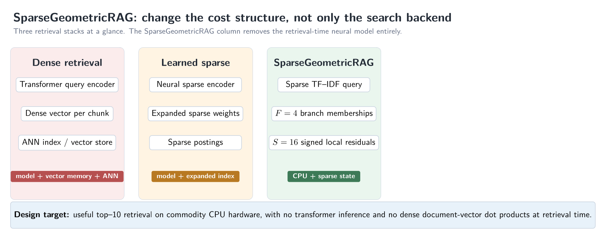
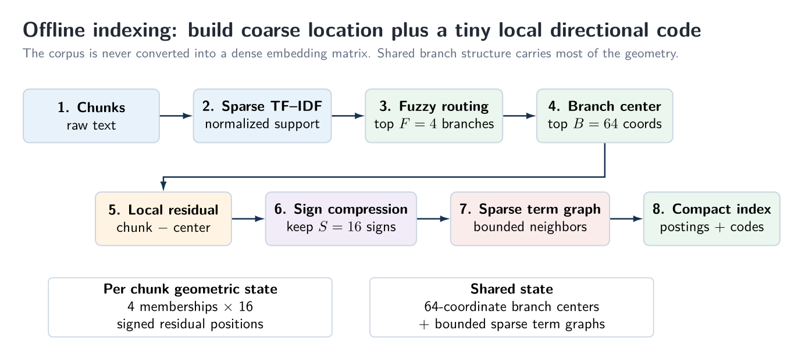
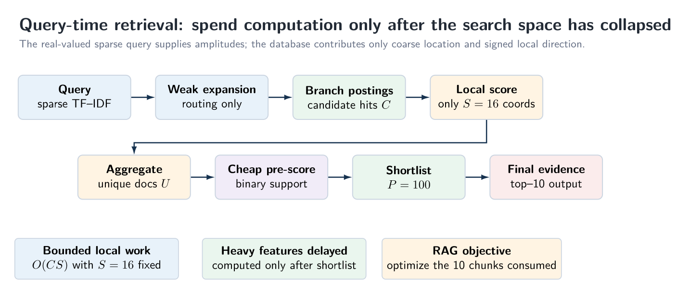
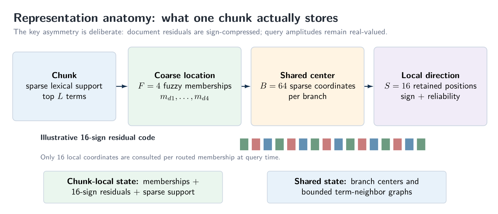
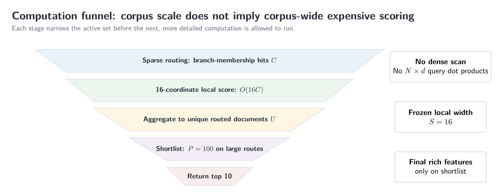
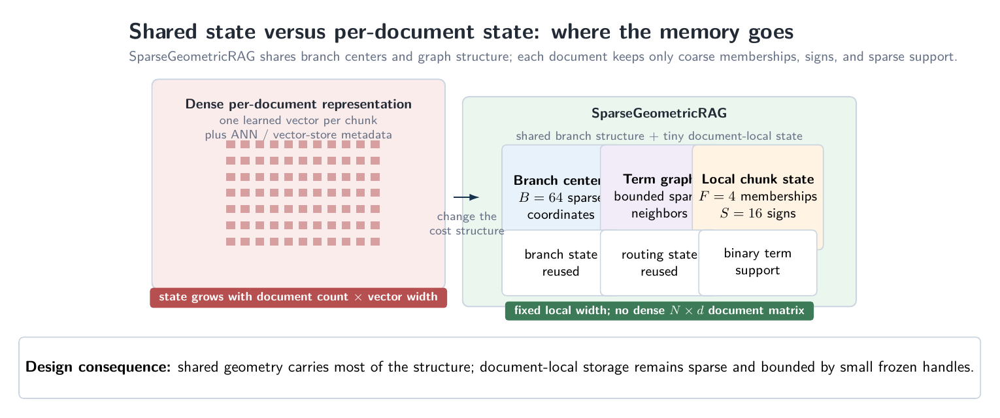
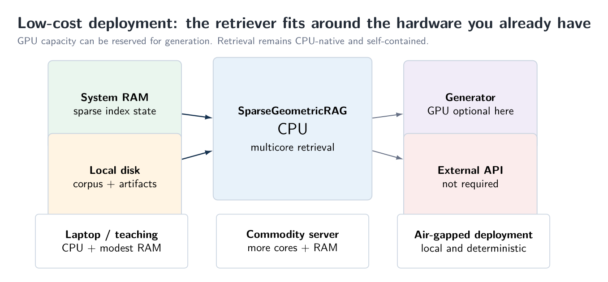
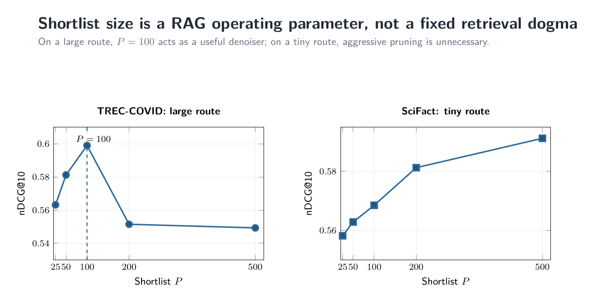
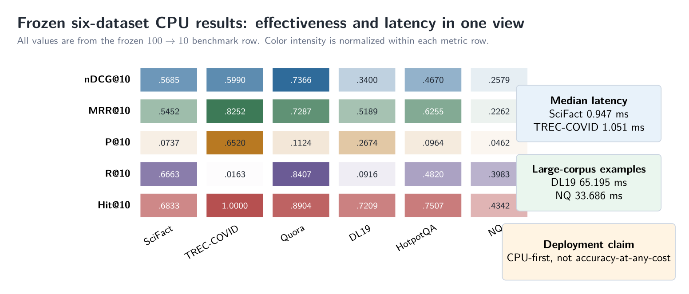
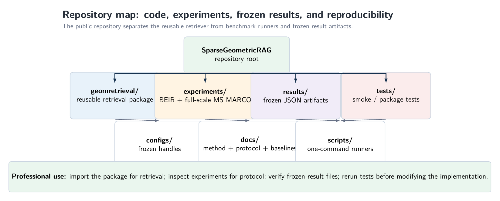

# SparseGeometricRAG

## CPU-first sparse geometric retrieval for practical top-10 RAG

**No transformer inference at retrieval time. No retrieval GPU requirement. No dense document-vector dot products. No external API.**

**Hugging Face mirror:** [Angshul/SparseGeometricRAG](https://huggingface.co/datasets/Angshul/SparseGeometricRAG)

SparseGeometricRAG is a retrieval system built around one systems objective: **make the retrieval layer cheap enough to run on ordinary multicore CPU hardware without turning the corpus into a dense embedding database.** It uses sparse TF-IDF geometry, fuzzy branch localization, and a tiny signed local residual code. The richer chunk-level evidence is delayed until after routing and shortlist reduction.

The project is not positioned as an accuracy-at-any-cost replacement for the strongest neural retrievers. Its selling point is the **quality / latency / hardware tradeoff**: useful top-10 retrieval with small structured state, bounded local computation, no retrieval-time transformer stack, and no requirement for a GPU or hosted inference service.

### At a glance

| Property | Frozen design |
|---|---|
| Query representation | sparse TF-IDF |
| Fuzzy memberships per chunk | `F = 4` |
| Sparse branch-center support | `B = 64` coordinates |
| Signed residual support | `S = 16` coordinates per membership |
| Weak routing expansion | bounded sparse neighborhood |
| Large-route shortlist | `P = 100` for the frozen six-dataset row |
| Final RAG output | top 10 chunks |
| Retrieval-time transformer | **none** |
| Retrieval-time GPU | **not required** |
| Dense vector per document | **not required** |

---

## 1. Why this design exists

Most modern retrieval systems optimize a learned representation and then optimize the search engine around that representation. SparseGeometricRAG changes the question: **can the representation itself be made sufficiently small and local that the retrieval engine no longer needs heavyweight dense-vector machinery?**

<p align="center">
  
</p>
<p align="center"><em>Figure 1. SparseGeometricRAG changes the cost structure of retrieval. Dense and learned-sparse stacks retain a neural representation stage; the proposed stack remains sparse and CPU-native at retrieval time.</em></p>

The key design choice is to store a **coarse sparse location plus a tiny local directional code**, rather than a dense vector for every chunk. The query remains sparse and real-valued, so it supplies fine amplitude information at runtime while the database stores only coarse branch position and signed local deviations.

This gives three practical consequences:

1. the stored geometric state per chunk is controlled by small fixed handles;
2. the decisive local comparison is bounded by only **16 residual coordinates per routed membership**; and
3. detailed lexical, semantic-support, and diversity calculations are postponed until the candidate set has already collapsed.

---

## 2. Architecture

### 2.1 Offline indexing

<p align="center">
  
</p>
<p align="center"><em>Figure 2. Offline indexing converts each chunk into sparse lexical support, four fuzzy branch memberships, and a 16-sign local residual code. Branch centers and sparse term graphs are shared structures.</em></p>

The index is constructed from sparse normalized TF-IDF. A chunk is assigned to its strongest fuzzy branches, each branch is represented by a sparse center, and the chunk's deviation from that center is compressed to a small signed residual code. A bounded sparse term graph provides weak second-order routing support. The result is a compact index consisting of branch postings, membership weights, local sign codes, binary term support, and shared sparse structures.

The frozen structural handles are:

| Handle | Frozen value | Role |
|---|---:|---|
| `F` | 4 | fuzzy branch memberships per chunk |
| `B` | 64 | sparse coordinates retained in each branch center |
| `S` | 16 | signed residual coordinates per chunk-branch membership |
| `L` | 12 | sparse chunk terms retained in the frozen geometry path |
| `P` | 100 | large-route shortlist for the final six-dataset row |

### 2.2 Query-time retrieval

<p align="center">
  
</p>
<p align="center"><em>Figure 3. Query-time computation is staged. Sparse routing finds candidate branch memberships; the local geometric comparison touches only 16 coordinates; detailed chunk evidence is evaluated only after shortlist reduction.</em></p>

A query is converted to sparse TF-IDF amplitudes. Weak second-order expansion is used only for routing; it is not a dense semantic representation. Routed branch postings produce candidate memberships. Each candidate is compared locally using the 16 retained signed residual coordinates, then aggregated at the document level. Cheap whole-chunk support provides an early lexical rescue/pre-score. Only a small shortlist proceeds to the richer final evidence calculation.

The final relevance score combines the geometric tail with whole-chunk lexical evidence, sparse semantic support, rare-term coverage, and coordination. Branch quality is estimated from the strongest branch-specific evidences; only high-quality branches are eligible for the small diversity bonus used for ranks 2-10. Rank 1 remains pure relevance.

### 2.3 What one chunk actually stores

<p align="center">
  
</p>
<p align="center"><em>Figure 4. The chunk-local geometric state is deliberately tiny: four fuzzy memberships and sixteen signed residual positions per membership. Branch centers and term-neighbor graphs are shared across chunks.</em></p>

The asymmetry between document and query representations is intentional. Document residual amplitudes are discarded after their signs and reliability structure have been retained; query amplitudes remain real-valued. The database therefore carries **direction**, while the query supplies **magnitude** at runtime.

This differs from dense retrieval, where every chunk generally contributes a full dense vector to the search object. Here, the local geometry is explicitly bounded by `F` and `S`, with sparse lexical support retained separately for the rescue and final evidence stages.

---

## 3. Complexity and why the method is fast

### 3.1 Query-time computation

Let:

- `Q` be the number of nonzero query terms;
- `K_r` be the retained routing neighbors per query term;
- `C` be the number of routed branch-membership hits;
- `U` be the number of unique routed documents;
- `S = 16` be the residual support;
- `P` be the final shortlist size; and
- `L_d` be the average binary-support length of a shortlisted chunk.

The main query-time stages are:

| Stage | Work |
|---|---:|
| Sparse query construction | `O(query tokens)` |
| Weak routing expansion | `O(Q K_r)` |
| Posting traversal | `O(C)` |
| Local geometric scoring | **`O(C S) = O(16 C)`** |
| Candidate aggregation | `O(C log C)` in the frozen reference path; `O(C)` in the preserved stamp-aggregation optimization |
| Cheap lexical rescue | proportional to routed/gated binary support |
| Shortlist selection | approximately linear partial selection in `U` |
| Final evidence extraction | performed only on the shortlist `P` |
| Top-10 construction | small overhead after shortlist features are available |

<p align="center">
  
</p>
<p align="center"><em>Figure 5. Corpus scale does not imply corpus-wide expensive scoring. Each stage reduces the active set before the next, richer computation is permitted to run.</em></p>

The decisive bounded term is the local geometric score: **only 16 coordinates are consulted for each routed membership**. Rich chunk-level evidence is deliberately positioned after routing and shortlist reduction. This is the main reason the system can stay CPU-native without replacing one expensive dense-search primitive by another.

### 3.2 Storage complexity

Ignoring implementation dtypes and small metadata, the structured state scales conceptually as

```text
O(N F S)
+ O(M B)
+ O(M (K_assoc + K_route))
+ O(total binary term support)
```

where `N` is the number of chunks and `M` is the vocabulary size. The first term is the chunk-local geometric state; the second and third are shared sparse structures; the final term is the whole-chunk binary lexical support.

With the frozen `F = 4` and `S = 16`, the local residual layer retains only **64 residual positions across the four memberships of a chunk**. This is the structural reason the method does not require an `N x d` dense document matrix.

<p align="center">
  
</p>
<p align="center"><em>Figure 9. The memory structure is deliberately asymmetric: branch centers and sparse graph structure are shared, while each chunk stores only coarse memberships, a 16-sign local residual code, and sparse lexical support.</em></p>

### 3.3 Preserved post-benchmark optimizations

The repository also preserves a later optimization branch that was developed after the frozen six-dataset benchmark. It introduces:

- stamp-based `O(C)` candidate aggregation instead of sort-based deduplication; and
- a gate before whole-chunk lexical scanning.

These optimizations are kept separate from the canonical benchmark implementation so that the reported frozen results are not silently changed after the fact.

---

## 4. Hardware and deployment requirements

<p align="center">
  
</p>
<p align="center"><em>Figure 6. Retrieval needs only CPU, system RAM, and local corpus/index storage. A GPU may still be used by the generator, but it is not a dependency of the retriever.</em></p>

The low-cost hardware story is central, not incidental. SparseGeometricRAG is designed for environments where a dedicated retrieval GPU is undesirable or unavailable: inexpensive servers, lab workstations, teaching machines, air-gapped systems, and deployments where accelerator memory is reserved for generation.

| Deployment | Retrieval requirement | Typical reason to use it |
|---|---|---|
| Laptop / teaching machine | ordinary CPU + modest RAM | development, instruction, small corpora |
| Commodity workstation/server | multicore CPU + more RAM | larger corpora and batch evaluation |
| Air-gapped / cost-constrained | CPU + local storage | no hosted model/API dependency |
| GPU-equipped RAG system | GPU optional for generator | retrieval does not compete for accelerator memory |

The claim is **not** that GPUs are undesirable. The claim is that **the retriever is designed so they are optional rather than mandatory**.

---

## 5. Why the objective is top-10 RAG

A practical generator usually consumes only a small number of retrieved chunks. For that reason, this repository treats shortlist size as a RAG operating parameter rather than assuming that the setting that maximizes deep recall must also be best for top-10 context selection.

<p align="center">
  
</p>
<p align="center"><em>Figure 7. TREC-COVID and SciFact expose opposite regimes. On the large TREC-COVID route, `P = 100` is a useful denoising operating point. On the tiny SciFact route, quality continues improving as aggressive pruning is relaxed.</em></p>

This is why the final benchmark emphasizes `nDCG@10`, `MRR@10`, `P@10`, `R@10`, `Hit@10`, and query latency. Deep recall remains useful as a diagnostic, but it is not allowed to determine the final RAG shortlist by itself.

---

## 6. Frozen six-dataset CPU results

<p align="center">
  
</p>
<p align="center"><em>Figure 8. Frozen `100 -> 10` effectiveness across six datasets, with representative median latencies. The result should be read as a quality/cost tradeoff rather than an accuracy-at-any-cost claim.</em></p>

### 6.1 OURS: concise benchmark row

| Dataset | nDCG@10 | MRR@10 | P@10 | R@10 | Hit@10 | Median latency (ms) | p95 latency (ms) |
|---|---:|---:|---:|---:|---:|---:|---:|
| SciFact | 0.5685 | 0.5452 | 0.0737 | 0.6663 | 0.6833 | 0.947 | 1.031 |
| TREC-COVID | 0.5990 | 0.8252 | 0.6520 | 0.0163 | 1.0000 | 1.051 | 1.193 |
| Quora | 0.7366 | 0.7287 | 0.1124 | 0.8407 | 0.8904 | 120.301 | 175.494 |
| MS MARCO / DL19 | 0.3400 | 0.5189 | 0.2674 | 0.0916 | 0.7209 | 65.195 | 142.647 |
| HotpotQA | 0.4670 | 0.6255 | 0.0964 | 0.4820 | 0.7507 | 28.944 | 42.568 |
| NQ | 0.2579 | 0.2262 | 0.0462 | 0.3983 | 0.4342 | 33.686 | 44.161 |

The strongest neural systems remain ahead in pure effectiveness on many datasets. SparseGeometricRAG instead targets the low-cost corner of the design space: **CPU-first retrieval with bounded sparse computation and no retrieval-time neural inference**.

---

## 7. Full benchmark suite

The full suite is intentionally retained. Missing entries are shown as `NR`; baselines are not removed merely because a compatible value is unavailable.

### 7.1 nDCG@10

| Method | SciFact | TREC-COVID | Quora | MS MARCO / DL19 | HotpotQA | NQ |
|---|---:|---:|---:|---:|---:|---:|
| Exact TF-IDF | 0.5780 | 0.3738 | NR | NR | NR | NR |
| BM25 | 0.6650 | 0.6560 | 0.7890 | 0.2280 | 0.6030 | 0.3290 |
| MiniLM + FAISS Flat | 0.6451 | 0.4725 | 0.8756 | 0.3654 | 0.4651 | 0.4387 |
| BGE-base + FAISS Flat | 0.7404 | 0.7807 | 0.8890 | 0.4135 | 0.7260 | 0.5415 |
| BGE-base + FAISS HNSW | 0.7404 | 0.7807† | 0.8890† | 0.4135† | 0.7260† | 0.5415† |
| BGE-base + FAISS IVF-Flat | 0.7255 | 0.7807† | 0.8890† | 0.4135† | 0.7260† | 0.5415† |
| BGE-base + FAISS IVF-PQ | 0.6979 | 0.7807† | 0.8890† | 0.4135† | 0.7260† | 0.5415† |
| BGE-base + hnswlib HNSW | 0.7404 | 0.7807† | 0.8890† | 0.4135† | 0.7260† | 0.5415† |
| BGE-base + ScaNN | 0.6783 | 0.7807† | 0.8890† | 0.4135† | 0.7260† | 0.5415† |
| Contriever-MS MARCO + FAISS | 0.6770 | 0.5960 | 0.8650 | 0.4070 | 0.6380 | 0.4980 |
| SPLADE++ | 0.7040 | 0.7270 | 0.8340 | 0.4330 | 0.6870 | 0.5370 |
| Modern ColBERT | 0.7645 | 0.8341 | 0.8754 | 0.4499 | 0.7667 | 0.6169 |
| **OURS — CPU, 100→10** | **0.5685** | **0.5990** | **0.7366** | **0.3400** | **0.4670** | **0.2579** |

### 7.2 MRR@10

| Method | SciFact | TREC-COVID | Quora | MS MARCO / DL19 | HotpotQA | NQ |
|---|---:|---:|---:|---:|---:|---:|
| Exact TF-IDF | 0.5437 | 0.5915 | NR | NR | NR | NR |
| BM25 | 0.6460 | 0.8530 | 0.7790 | 0.1800 | 0.8030 | 0.2630 |
| MiniLM + FAISS Flat | 0.6110 | 0.7244 | NR | NR | 0.4446 | NR |
| BGE-base + FAISS Flat | 0.7034 | 0.9180 | 0.8823 | 0.3502 | 0.8611 | 0.4924 |
| BGE-base + FAISS HNSW | 0.7034 | 0.9180† | 0.8823† | 0.3502† | 0.8611† | 0.4924† |
| BGE-base + FAISS IVF-Flat | 0.6879 | 0.9180† | 0.8823† | 0.3502† | 0.8611† | 0.4924† |
| BGE-base + FAISS IVF-PQ | 0.6615 | 0.9180† | 0.8823† | 0.3502† | 0.8611† | 0.4924† |
| BGE-base + hnswlib HNSW | 0.7034 | 0.9180† | 0.8823† | 0.3502† | 0.8611† | 0.4924† |
| BGE-base + ScaNN | 0.6494 | 0.9180† | 0.8823† | 0.3502† | 0.8611† | 0.4924† |
| Contriever-MS MARCO + FAISS | 0.6207 | NR | NR | NR | NR | NR |
| SPLADE++ | 0.6699 | NR | NR | 0.3830 | NR | NR |
| Modern ColBERT | 0.7390 | 0.9533 | 0.8671 | 0.3849 | 0.9188 | 0.5655 |
| **OURS — CPU, 100→10** | **0.5452** | **0.8252** | **0.7287** | **0.5189** | **0.6255** | **0.2262** |

### 7.3 Precision@10

| Method | SciFact | TREC-COVID | Quora | MS MARCO / DL19 | HotpotQA | NQ |
|---|---:|---:|---:|---:|---:|---:|
| Exact TF-IDF | 0.0797 | 0.4020 | NR | NR | NR | NR |
| BM25 | 0.0863 | 0.6360 | ~0.1200 | NR | NR | NR |
| MiniLM + FAISS Flat | 0.0883 | 0.5040 | 0.1337 | 0.0591 | 0.0974 | 0.0770 |
| BGE-base + FAISS Flat | 0.0987 | 0.8300 | 0.1346 | 0.0656 | 0.1515 | 0.0884 |
| BGE-base + FAISS HNSW | 0.0987 | 0.8300† | 0.1346† | 0.0656† | 0.1515† | 0.0884† |
| BGE-base + FAISS IVF-Flat | 0.0973 | 0.8300† | 0.1346† | 0.0656† | 0.1515† | 0.0884† |
| BGE-base + FAISS IVF-PQ | 0.0950 | 0.8300† | 0.1346† | 0.0656† | 0.1515† | 0.0884† |
| BGE-base + hnswlib HNSW | 0.0987 | 0.8300† | 0.1346† | 0.0656† | 0.1515† | 0.0884† |
| BGE-base + ScaNN | 0.0887 | 0.8300† | 0.1346† | 0.0656† | 0.1515† | 0.0884† |
| Contriever-MS MARCO + FAISS | 0.0883 | NR | NR | NR | NR | NR |
| SPLADE++ | 0.0937 | NR | NR | NR | NR | NR |
| Modern ColBERT | 0.0977 | 0.8820 | 0.1327 | 0.0701 | 0.1548 | 0.0979 |
| **OURS — CPU, 100→10** | **0.0737** | **0.6520** | **0.1124** | **0.2674** | **0.0964** | **0.0462** |

### 7.4 Recall@10

| Method | SciFact | TREC-COVID | Quora | MS MARCO / DL19 | HotpotQA | NQ |
|---|---:|---:|---:|---:|---:|---:|
| Exact TF-IDF | 0.7135 | 0.0105 | NR | NR | NR | NR |
| BM25 | 0.7809 | 0.0158 | 0.8854 | NR | 0.6531 | NR |
| MiniLM + FAISS Flat | 0.7833 | 0.0128 | 0.9503 | 0.5676 | 0.4870 | 0.6471 |
| BGE-base + FAISS Flat | 0.8742 | 0.0221 | 0.9574 | 0.6277 | 0.7574 | 0.7469 |
| BGE-base + FAISS HNSW | 0.8742 | 0.0221† | 0.9574† | 0.6277† | 0.7574† | 0.7469† |
| BGE-base + FAISS IVF-Flat | 0.8609 | 0.0221† | 0.9574† | 0.6277† | 0.7574† | 0.7469† |
| BGE-base + FAISS IVF-PQ | 0.8441 | 0.0221† | 0.9574† | 0.6277† | 0.7574† | 0.7469† |
| BGE-base + hnswlib HNSW | 0.8742 | 0.0221† | 0.9574† | 0.6277† | 0.7574† | 0.7469† |
| BGE-base + ScaNN | 0.7814 | 0.0221† | 0.9574† | 0.6277† | 0.7574† | 0.7469† |
| Contriever-MS MARCO + FAISS | 0.7868 | NR | NR | NR | NR | NR |
| SPLADE++ | 0.8230 | NR | NR | NR | NR | NR |
| Modern ColBERT | 0.8647 | 0.0230 | 0.9516 | 0.6710 | 0.7739 | 0.8239 |
| **OURS — CPU, 100→10** | **0.6663** | **0.0163** | **0.8407** | **0.0916** | **0.4820** | **0.3983** |

### 7.5 Hit@10

| Method | SciFact | TREC-COVID | Quora | MS MARCO / DL19 | HotpotQA | NQ |
|---|---:|---:|---:|---:|---:|---:|
| Exact TF-IDF | 0.7333 | 0.8600 | NR | NR | NR | NR |
| BM25 | 0.8033 | 1.0000 | 0.9286 | NR | NR | NR |
| MiniLM + FAISS Flat | NR | NR | NR | NR | NR | NR |
| BGE-base + FAISS Flat | 0.8833 | NR | NR | NR | NR | NR |
| BGE-base + FAISS HNSW | 0.8833 | NR | NR | NR | NR | NR |
| BGE-base + FAISS IVF-Flat | 0.8700 | NR | NR | NR | NR | NR |
| BGE-base + FAISS IVF-PQ | 0.8567 | NR | NR | NR | NR | NR |
| BGE-base + hnswlib HNSW | 0.8833 | NR | NR | NR | NR | NR |
| BGE-base + ScaNN | 0.7900 | NR | NR | NR | NR | NR |
| Contriever-MS MARCO + FAISS | 0.7967 | NR | NR | NR | NR | NR |
| SPLADE++ | 0.8333 | NR | NR | NR | NR | NR |
| Modern ColBERT | 0.8100 | NR | NR | NR | NR | NR |
| **OURS — CPU, 100→10** | **0.6833** | **1.0000** | **0.8904** | **0.7209** | **0.7507** | **0.4342** |

### 7.6 Median query latency (ms)

| Method | SciFact | TREC-COVID | Quora | MS MARCO / DL19 | HotpotQA | NQ |
|---|---:|---:|---:|---:|---:|---:|
| Exact TF-IDF | 6.197 | 50.185 | NR | NR | NR | NR |
| BM25 | 0.561 | 4.912 | NR | NR | NR | NR |
| MiniLM + FAISS Flat | NR | NR | NR | NR | NR | NR |
| BGE-base + FAISS Flat | 10.013 | NR | NR | NR | NR | NR |
| BGE-base + FAISS HNSW | 10.369 | NR | NR | NR | NR | NR |
| BGE-base + FAISS IVF-Flat | 10.050 | NR | NR | NR | NR | NR |
| BGE-base + FAISS IVF-PQ | 13.910 | NR | NR | NR | NR | NR |
| BGE-base + hnswlib HNSW | 10.594 | NR | NR | NR | NR | NR |
| BGE-base + ScaNN | 9.947 | NR | NR | NR | NR | NR |
| Contriever-MS MARCO + FAISS | 7.472 | NR | NR | NR | NR | NR |
| SPLADE++ | 13.493 | NR | NR | NR | NR | NR |
| Modern ColBERT | 62.671 | NR | NR | NR | NR | NR |
| **OURS — CPU, 100→10** | **0.947** | **1.051** | **120.301** | **65.195** | **28.944** | **33.686** |

### 7.7 p95 query latency (ms)

| Method | SciFact | TREC-COVID | Quora | MS MARCO / DL19 | HotpotQA | NQ |
|---|---:|---:|---:|---:|---:|---:|
| Exact TF-IDF | 14.605 | 56.716 | NR | NR | NR | NR |
| BM25 | 5.645 | 7.336 | NR | NR | NR | NR |
| MiniLM + FAISS Flat | NR | NR | NR | NR | NR | NR |
| BGE-base + FAISS Flat | 15.398 | NR | NR | NR | NR | NR |
| BGE-base + FAISS HNSW | 12.925 | NR | NR | NR | NR | NR |
| BGE-base + FAISS IVF-Flat | 16.303 | NR | NR | NR | NR | NR |
| BGE-base + FAISS IVF-PQ | 18.496 | NR | NR | NR | NR | NR |
| BGE-base + hnswlib HNSW | 13.293 | NR | NR | NR | NR | NR |
| BGE-base + ScaNN | 11.858 | NR | NR | NR | NR | NR |
| Contriever-MS MARCO + FAISS | 9.628 | NR | NR | NR | NR | NR |
| SPLADE++ | 19.156 | NR | NR | NR | NR | NR |
| Modern ColBERT | 70.994 | NR | NR | NR | NR | NR |
| **OURS — CPU, 100→10** | **1.031** | **1.193** | **175.494** | **142.647** | **42.568** | **44.161** |

**Notes.** `NR` means “not reported under a compatible metric / protocol in the current ledger.” `†` indicates that, outside SciFact, the BGE ANN-backend rows mirror the BGE-base representation-level effectiveness reference rather than a separately rerun backend-specific effectiveness experiment.

---

## 8. Interpreting the latency numbers

Speed comparisons in retrieval are easy to misstate. ANN papers frequently report **search-only** latency after a dense query embedding already exists, whereas a deployed RAG request pays for query representation, retrieval, shortlist scoring, and final selection.

This repository therefore follows two rules:

1. **do not silently compare ANN-only latency with end-to-end retrieval latency**; and
2. **do not fill missing latency cells using measurements from incompatible hardware or protocols**.

The full provenance policy is documented in `docs/BASELINE_SUITE.md` and `docs/LITERATURE_AND_SPEED.md`. The frozen OURS timings include the retrieval path used by the reported experiment. For the MS MARCO column, OURS is the 43-query TREC-DL19 run on the full 8.84M-passage corpus; published model-reference values in that column may use MS MARCO dev where applicable.

---

## 9. Repository organization

The repository is deliberately split between reusable retrieval code, clean benchmark runners, the full-scale experimental campaign, and frozen outputs.

| Path | Purpose |
|---|---|
| `geomretrieval/` | reusable sparse geometric retriever |
| `experiments/beir/` | BEIR runners and pool-sweep experiments |
| `experiments/msmarco_scale/` | full MS MARCO scale campaign |
| `experiments/postbenchmark_optimizations/` | preserved later optimization branch |
| `results/` | frozen JSON outputs and benchmark artifacts |
| `configs/` | reproduction handles |
| `baselines/` | baseline utilities |
| `scripts/` | runnable helpers |
| `docs/` | method, RAG protocol, baseline, speed, and reproducibility notes |
| `tests/` | smoke tests |
| `manifests/` | corpus / run manifests |

The final six-dataset artifacts are under `results/final_100_to_10/`. The later stamp-aggregation and lexical-gating optimization results are preserved separately and are not used to rewrite the frozen benchmark row.

<p align="center">
  
</p>
<p align="center"><em>Figure 10. The repository separates reusable retrieval code, benchmark runners, frozen results, configuration handles, documentation, scripts, and tests so that professional users can inspect or reuse only the layer they need.</em></p>

---

## 10. Reproducibility

The repository contains the exact frozen result JSONs, benchmark scripts, configuration handles, and tests used to reconstruct the final evaluation. The reference package was checked with the project smoke tests before release.

For a clean reproduction path, start with:

1. `docs/METHOD.md` - algorithmic description;
2. `docs/RAG_PROTOCOL.md` - top-10 evaluation protocol;
3. `docs/REPRODUCIBILITY.md` - environment and run guidance;
4. `docs/BASELINE_SUITE.md` - baseline/provenance policy; and
5. `results/final_100_to_10/` - frozen final outputs.

The code is intentionally CPU-first. Baseline packages that depend on neural encoders or ANN libraries are listed separately from the core requirements.

---

## 11. Scope of the claim

### What this repository claims

- a **CPU-first** retrieval architecture with no retrieval-time transformer inference;
- no requirement for a dense vector per document or a GPU-based retrieval service;
- fixed small structural handles (`F = 4`, `B = 64`, `S = 16`) controlling local geometry;
- local geometric scoring bounded by `O(CS)` with `S = 16` fixed;
- deliberate postponement of richer chunk-level computation until after routing and shortlist reduction;
- a practical top-10 RAG operating point validated across six datasets;
- complete benchmark tables rather than selective reporting of only OURS.

### What it does not claim

- dominance over the strongest neural retrievers in pure effectiveness;
- that every latency cell in the literature is directly comparable across hardware and protocol;
- that one shortlist size is mathematically optimal for every dataset or route size;
- that deep recall is irrelevant. It is retained as a diagnostic, but it is not the sole deployment objective.

---

## 12. License

This GitHub repository mirrors the public release distributed under the **FAIR Noncommercial Research License** designation. The corresponding license declaration is maintained on the [Hugging Face mirror](https://huggingface.co/datasets/Angshul/SparseGeometricRAG). Check those terms before redistribution or commercial use.
